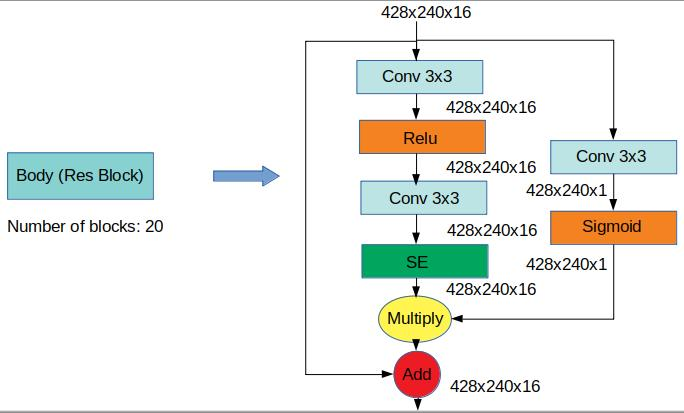
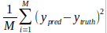
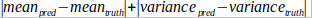

# Sensifai Mobile Image & Video Enhancement
There are many images in our albums which are far from ideal due to bad lighting conditions, low resolutions of old cameras, or incorrect automatic setting of the camera.

Sensifai Image and Video Enhancement App automatically improve your low-quality images using an advanced artificial intelligence (AI) method based on deep neural networks! This app offers a fast and end2end approach to increase the lighting in dark pictures, improve contrast and brightness, shoot up the resolution, and adjust tones.

The software which is publicly available as an SDK as well as an Android App works in three modes: automatic enhancement, superresolution, and manual improvement. One can use one of these modes to enhance a specific picture according to a required correction and modification.

- In automatic enhancement mode, the software applies a deep-learning model to automatically improve your image quality. For example, it increases the lighting of the images and improves the brightness without any effort from the users. Then it shows both images before and after the enhancement and lets the user compare them and save the enhanced image or remove it.

- In superresolution mode, the program helps to increase the resolution of the images automatically using a deep-neural network system.

- In manual improvement mode, the software provides a set of tools such that the users apply different filters manually to re-color or adjust the brightness of the picture. This mode is also accessible after an image was treated in superresolution or automatic enhancement modes.


There are different image enhancement Apps (Letsenhance.io and Google DeepAngel) that improve the quality of images or edit them automatically through advanced artificial intelligence. These apps require users to send their images to their cloud to process them. This increases the risk of getting hacked, scandalized, or abused and potentially violates the privacy of millions of users. This is all because these apps work based on deep-learning that is computationally heavy and requires strong GPU servers.

SensifAI offers a game-changing technology that solves this problem. We have developed specific deep learning architectures for the smartphone chipsets of most major smartphone manufacturers. With this technology, we can enhance users’ images and videos locally on their smartphones without any connection to the internet. This is an on-device, smart-enhance App that can help millions of people enhance their video/image archives while guaranteeing control over their personal data.
Many thanks to the Next Generation Internet (NGI) initiative of the European Commission and NGI Trust consortium partners for their support and help during the development of Sensifai image and video enhancement app.

## Enhancement Engine
Earlier methods are mostly based on histogram equalization and gamma correction. The performance of these methods is limited by the fact that individual pixels are enhanced without consideration to contextual information. Many enhancement algorithms based on the Retinex theory [1] have been suggested in the literature [2,3]. More advanced techniques estimate and normalize illumination to get the enhanced image [4,5,6]. Recently, deep convolutional neural networks (DCNNs) have gained great success in image enhancement [7,8]. Ignatov et al. [9] propose DPED to produce DLSR- from mobile quality images by using deep residual networks trained with a composite loss function of content, color, and texture. Also, a Fast and Efficient image Quality Enhancement as FEQE for image super-resolutin and enhancement on mobile devices has been introduced in [10].
In this project, we used residual blocks with some modifications for the model. In our model, we applied Spacial Channel Attention (SCA) Technique to get more discriminative features.  Channel attention technique by the implementation of Squeeze and Excitation (SE) Block extracts more discriminative features by weighting each of the channels adaptively.  Additionally, we have utilized Spacial Attention as a feature guide block which exploits the nature of low-level features to obtain more discriminative features. Because Low-level features have spatial and local information,  therefore , feature guide block can help to better locate the corners and edges of objects. In our model, we have utilized desubpixel and subpixel layers in down-sampling and up-sampling respectively.
Fig1. illustrates the Res Block with some modifications.



a new penalty term to multiply in MSE loss function. Since the luminance and contrast are not considered directly in mean square error (MSE) loss function and due to the importance of them, we used the luminance and contrast as a penalty term. This penalty term consists of difference between mean and variance of the input image and it’s ground truth. 
    
Loss function = Penalty_Term * MSE
    
MSE=  
    
Penalty_Term=  [1+(-log(1-(difference/2)))],        0 < difference/2 < +1
    
difference= 


Finally, SENSIFAI_512 dataset have been created by SENSIFAI company. Since the size of downloaded images was very larg, we decided to resize images to 512x512. The total number of images in this dataset is 15000 which we have selected 20% as a validation part. Input images in this dataset have been created by Rawtherapee app.  


## Android SDK
This repository contains an Android SDK for Sensifai Image & Video Enhancement. This SDK brings the ability to any Android mobile application which needs to enhance the quality of images or videos. The AI engine of this SDK enhances the color range and resolution of input image or video in real-time.

### Build
Clone this repository and import into **Android Studio**
From the gradle menu choose assembleRelease/assembleDebug Option to build the AAR file (in /enhancement/build/outputs/aar)

### Usage
Create a new Android Application Project and import the AAR file as a dependency
add the following dependencies to `build.gradle` file:
***TFLite***
```gradle
    implementation 'org.tensorflow:tensorflow-lite:0.0.0-nightly'
    implementation 'org.tensorflow:tensorflow-lite-gpu:0.0.0-nightly'
    implementation 'org.tensorflow:tensorflow-lite-support:0.0.0-nightly'
    implementation 'org.tensorflow:tensorflow-lite-hexagon:0.0.0-nightly'
```
***SNPE***
(import `snpe-release.aar` file as module dependency into the project)
```gradle
    implementation project(':snpe-release')
```
